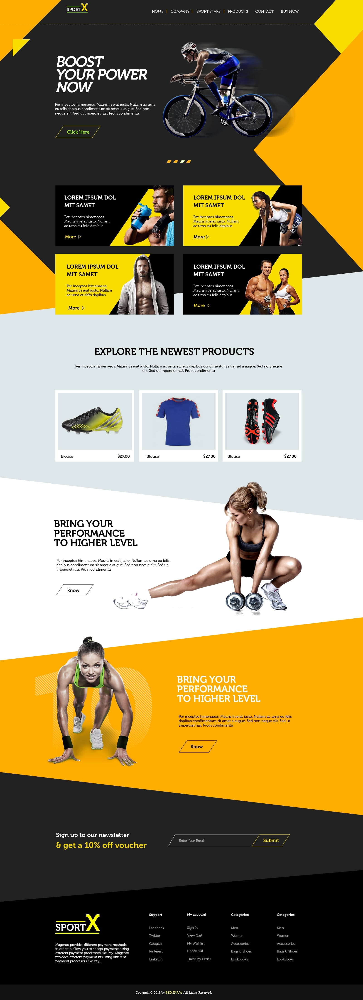

# SportX

Adaptive layout single page site with PSD. 

PSD and JPG are inside the "template" folder.

What I use in project:

 - npm, gulp, bower
 - sass, flexbox, svg sprite, preloader, normalize.css, css hamburgers
 - jquery, pushy menu, slick carousel
 

